# 🧠 NATIONAL INTERCONNECTED SYSTEM OF BOLIVIA: Predictive Analytics for Grid Stability & Inertia Forecasting

 

## 📌 Project Executive Overview
As the **Bolivian National Interconnected System (SIN)** integrates more Variable Renewable Energy (VRE), the reduction of **Equivalent System Inertia ($H_{sys}$)** poses a significant threat to grid stability. 

This project delivers an advanced predictive framework to forecast $H_{sys}$ margins with high precision. Using 16 years of operational data (2010-2026), I developed a multi-stage pipeline that balances computational efficiency with industrial-grade accuracy.

 

## 🚀 Key Performance Indicators (KPIs)
| Metric | Linear Regression | **XGBoost (Champion)** | LSTM (Deep Learning) |
| :--- | :---: | :---: | :---: |
| **MAE (Seconds)** | 0.0554 | **0.0483** | 0.0675 |
| **RMSE (Seconds)** | 0.0809 | **0.0668** | 0.0887 |
| **R² Score** | 0.8494 | **0.8976** | 0.8194 |

**Strategic Outcome:** The XGBoost model provides a **12.73% improvement** in error reduction over the baseline, ensuring a robust safety buffer for the **3.5s stability limit**.

 

## 📊 Strategic Visualizations & Technical Insights

### 1. Model Tracking Fidelity
The visualization below confirms the model's exceptional ability to "track" the daily inertia valleys caused by solar displacement during the **2026 validation period**.

.png)

> **Finding:** The model exhibits high stability during transient morning ramps (06:00-09:00), where VRE penetration typically compromises synchronous mass.

### 2. Feature Attribution (Interpretability)
We moved beyond "black-box" modeling by analyzing the gain-based importance of each variable.

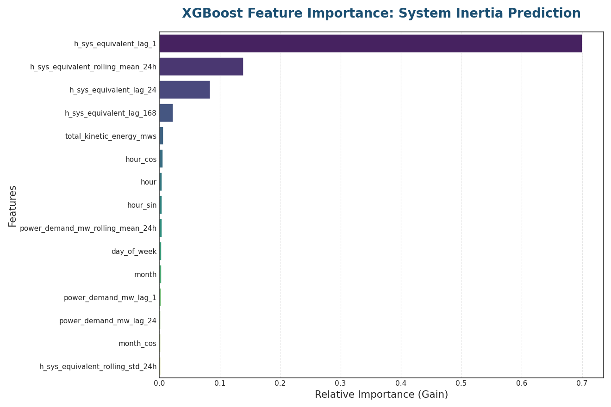

> **Finding:** **h_sys_equivalent_lag_1** accounts for **70.01%** of the predictive weight. This statistically validates the "Temporal Momentum" of the power grid.

### 3. Global Benchmarking
A comparative analysis of the three architectures explored during the project.

.png)

> **Finding:** Despite the complexity of the LSTM, **XGBoost** emerged as the superior choice due to its ability to exploit high-autocorrelation features in tabular time-series data.

 

## 🛠️ Advanced Methodology
To ensure world-class standards, I implemented:
* **Cyclical Time Encoding:** Sine/Cosine transformations for hours and months to preserve periodic continuity.
* **StandardScaler Calibration:** Scaling fitted *only* on training data (2010-2024) to eliminate **Data Leakage** in the 2025-2026 test set.
* **Recursive Lag Engineering:** Integration of $t-24$ and $t-168$ features to capture circadian and weekly seasonality.

 

## 📊 Bolivian National Interconnected System Analysis

 

### 1. **Historical Evolution of Electricity Demand**
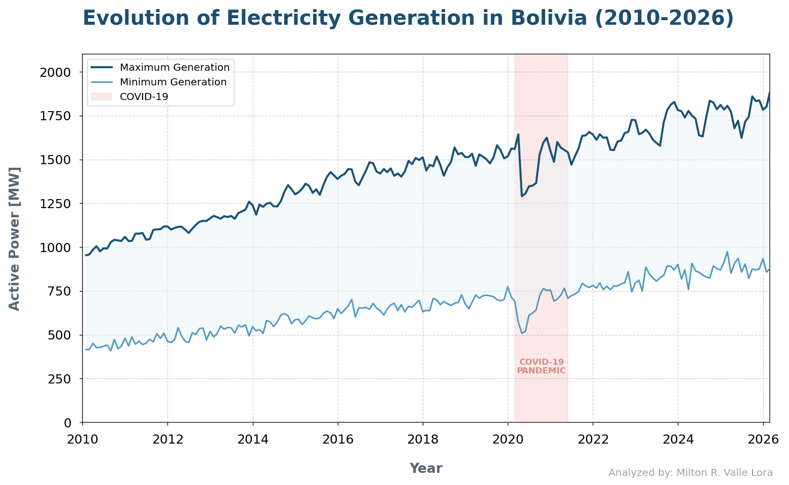

>- **Growth Dynamics**: From a monthly peak of ~1,000 MW in 2010, the system has scaled to nearly 1,850 MW by early 2026, representing an almost 85% increase in capacity requirements.
>
>- **The Anomaly**: Starting in March 2020, we observe a sharp contraction in demand because of COVID-19. This is a structural break where the historical correlation between economic activity and energy consumption was temporarily decoupled.

 

### 2. **Max Total Power Balance of Generation, Demand and Planning**
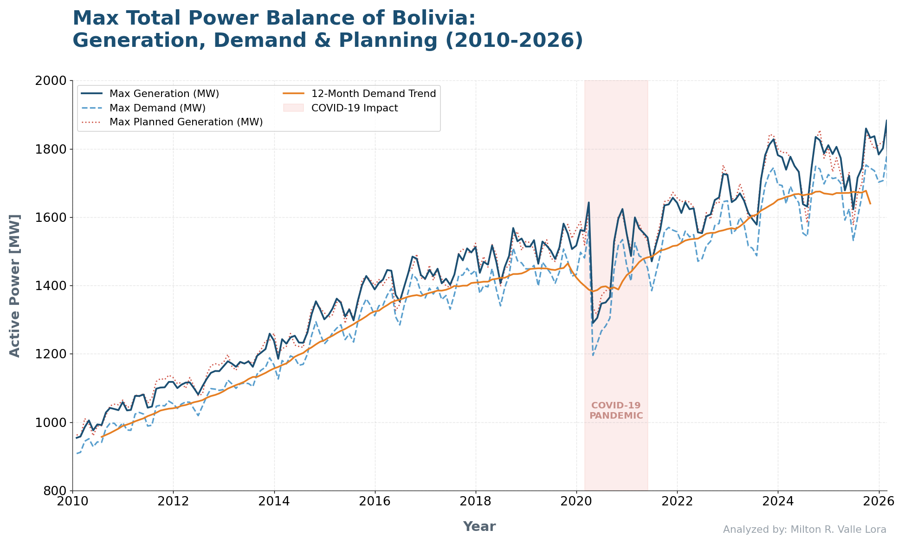

>- **Technical Losses**: This gap represents the energy lost during transmission and distribution across the Bolivian grid.
>
>- **Spinning Reserves**: The excess generation is the "safety cushion" required to maintain frequency stability at 50Hz.
>
>- **Statistical Implication**: The fact that these lines never cross confirms that the CNDC successfully maintained the Reserve Margin throughout the 16-year horizon, even during peak stress periods in 2025.
>
>- **Fidelity Analysis**: During the early years (2010–2015), the planning line closely tracked actual generation. However, in the 2022–2026 window, the variance increases.

 

### 3. Real VS. Expected Generation in Bolivia (Residual Analysis)
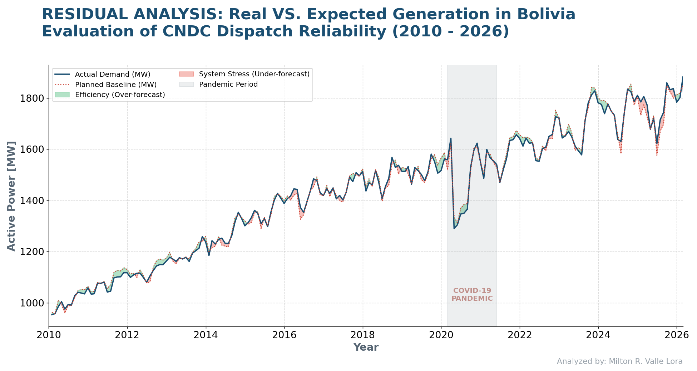

>- **Green Zones (Over-forecast)**: These regions represent periods where the planned generation exceeded the actual requirement. From a technical standpoint, this indicates a High Safety Margin, but potentially higher operational costs due to unnecessary unit synchronization.
>
>- **Red Zones (Under-forecast)**: These are the Stress Windows. During these periods, the actual demand surpassed the initial CNDC dispatch plan, forcing the use of emergency reserves or unscheduled peaking plants.
>
>- **Pandemic Volatility**: Note the erratic transition between red and green during 2020-2021. The pandemic broke the traditional seasonal patterns, making historical "averages" obsolete for dispatch planning.

 

### 4. Evolution of Bolivia's Average Load Profile per Year

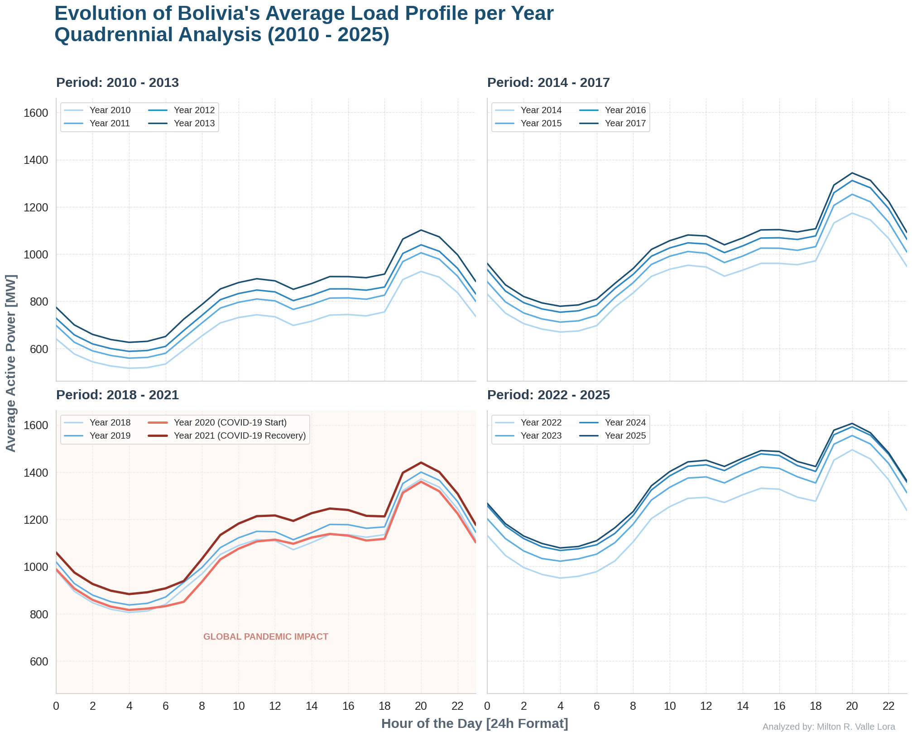

>- **Vertical Demand Migration**: A consistent upward shift is observed. In the 2010–2013 period, the average peak demand was near 1,050 MW. By the end of 2025, this has scaled to 1,694 MW, reflecting sustained growth in national electrical infrastructure.
>
>- **Demand Contraction**: In a departure from historical growth trends, the year 2020 (light red line) shows a significant reduction in the average load profile compared to 2019, breaking the vertical upward momentum.
>
>- **Resilience and Recovery**: The overlap during 2021 suggests that the system required over a year to realign with its pre-crisis growth trajectory.
>
>- **Economic Impact**: The lack of vertical separation between 2024 and 2025 is a direct indicator of slowed economic activity and reduced domestic consumption due to inflationary pressures in Bolivia during 2025.

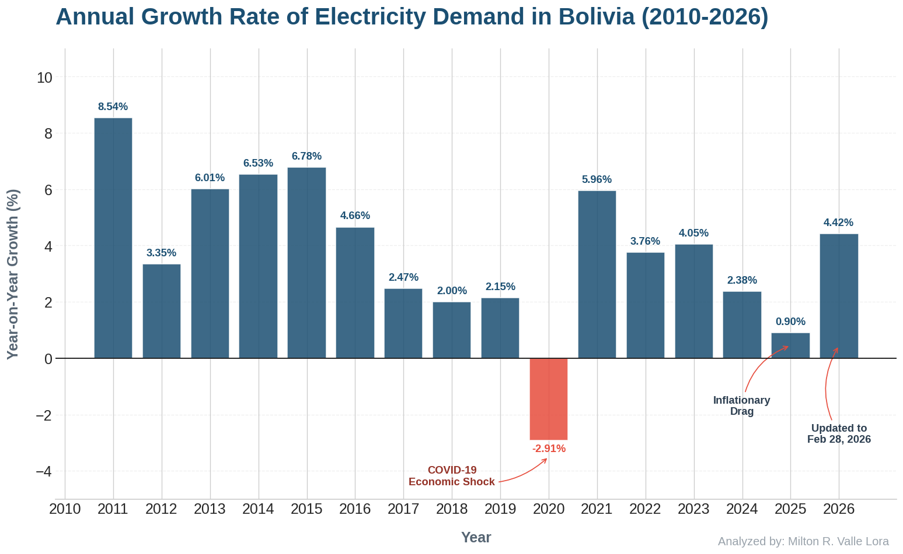 

 

### 5. Average Power Demand in Bolivia during the Week

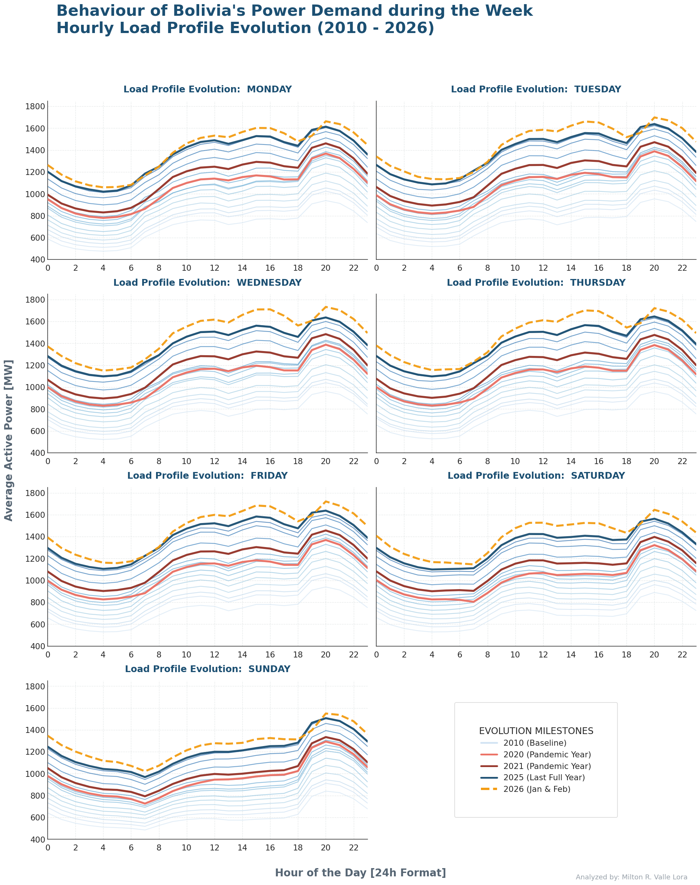

>- **Systematic Baseline Growth and Vertical Displacement**: The most striking feature of the 16-year horizon is the consistent vertical displacement across all seven days of the week. This shift represents an approximate 85% increase in base load since 2010, reflecting both the expansion of the National Interconnected System (SIN) and the steady growth of national electricity coverage. From a system planning perspective, this indicates a robust long-term growth trend that requires constant capacity additions in both generation and transmission.
>
>- **Evolution of the Circadian Rhythm and Night Peak**: The load profiles maintain a classic bimodal shape, characterized by a midday peak (associated with commercial and light industrial activity) and a more pronounced Night Peak.
>    - **The "Duck Curve" Resilience**: Unlike systems with high penetration of non-dispatchable solar energy, Bolivia’s profile still shows a significant ramp-up between 18:00 and 20:00.
>    - **Peak Intensity**: The night peak (19:00 - 21:00) remains the most critical stress point for the grid, driven primarily by residential lighting and domestic thermal loads.
>
>- **Weekend Dynamics and Residential Proxy**: There is a clear distinction between Working Days (Mon-Fri) and the Weekend (Sat-Sun):
>    - **Sunday Analysis**: The Sunday profile serves as a "pure" proxy for residential base load. The peak is approximately 15% lower than on Tuesdays or Wednesdays, confirming the absence of large industrial consumers during the weekend.
>    - **Saturday Transition**: Saturday acts as a hybrid, showing industrial ramp-downs starting at noon, which provides valuable data for scheduling maintenance windows without risking system stability.
>
>- **The "Pandemic Shock" (2020-2021) and Structural Deviation**: The years 2020 and 2021 (highlighted in red) represent a structural anomaly in the historical series.
>    - **Load Suppression**: During the 2020 lockdown, we observe a significant "flattening" of the midday peak as commercial and industrial activities ceased.
>     - **Recovery Lag**: The 2021 recovery shows the system struggling to return to its pre-pandemic growth trajectory, highlighting the high sensitivity of the electricity sector to macroeconomic shocks.

 

### 6. Load Intensity (Seasonal and Circadian Analysis)

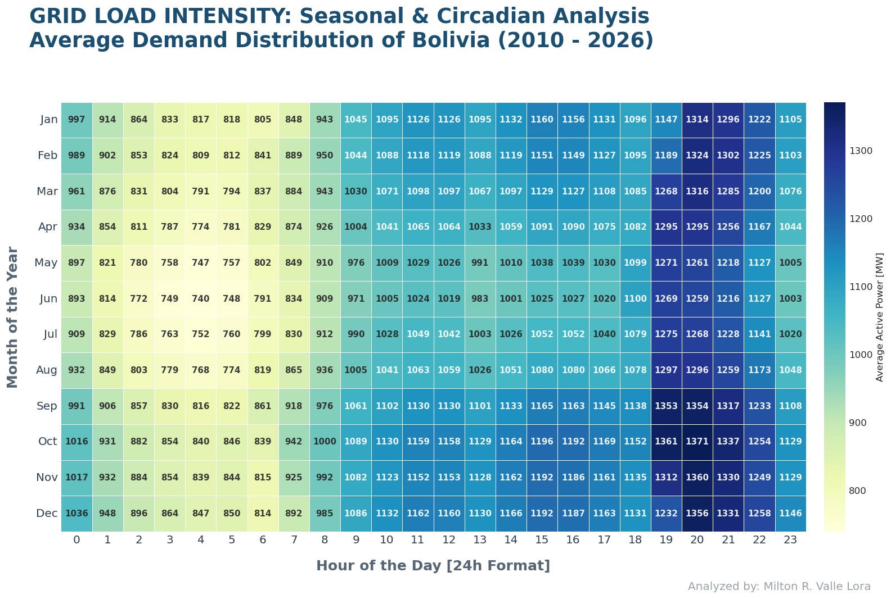

>- **Circadian Dominance (Night Peak)**: The visualization confirms that the 19:00 to 21:00 window is the most critical period for system stability across all months.
>    - **Peak Intensity**: The system consistently reaches its maximum mean load at 20:00, with values exceeding 1,312 MW.
>    - **Residential Synergy**: This "Night Peak" represents the simultaneous convergence of residential lighting, domestic thermal loads, and late-evening commercial activity.
>
>- **Summer & Spring Expansion (Seasonal Dynamics)**: Contrary to expectations in colder climates, the data indicates a significant increase in demand during the late Spring and Summer months (September–January).
>    - **Seasonal Peaks**: The months of October and November show the highest average monthly demand (exceeding 1,080 MW), likely driven by industrial year-end ramps and the increased use of refrigeration/cooling systems as temperatures rise.
>    - **Winter Behavior**: Demand actually stabilizes at lower levels during the Southern Hemisphere's winter (June–August), with average loads dropping to approximately 970–1,000 MW.
>
>- **Operational Planning (Strategic Maintenance Windows)**: The "cool zones" of the heatmap identify the hours between 02:00 and 05:00 AM as the optimal technical windows for infrastructure interventions.
>    - **Base Load Stability**: During this timeframe, demand falls to its historical minimum (averaging ~793 MW), allowing for scheduled maintenance of high-voltage substations and transmission lines with minimal risk to system reliability.

 

### 7. Forecast Error Distribution & Statistical Density

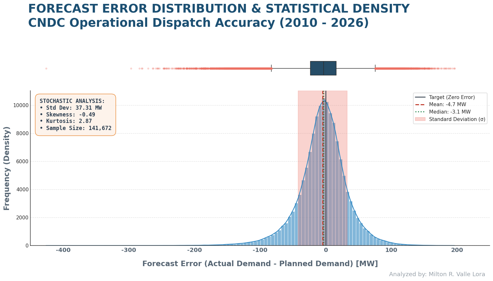

>- **The Boxplot (Identification of Systemic Risk & Extreme Failures)**: The upper segment focuses on the dispersion and outliers of the planning process.
>    - **Interquartile Range (IQR)**: The central box represents where 50% of the daily planning errors fall. A narrow box indicates high consistency in the CNDC's day-ahead scheduling.
>    - **Whiskers and Outliers (The "Fliers")**: The individual points extending beyond the whiskers are Extreme Planning Failures. From a Professional perspective, these are "Black Swan" events—sudden outages, weather anomalies, or unexpected industrial shutdowns that the current planning methodology failed to capture.
>    - **Operational Insight**: These outliers represent moments where the grid was likely at risk of frequency instability or required expensive, unscheduled emergency generation.
>
>-  **The Histogram & KDE (Central Tendency and Probability)**: The lower segment visualizes the frequency and probability density of the errors.
>    - **Mean vs. Median (Bias Detection)**: If the Mean (Red line) and Median (Green line) are close to the Zero-Error axis, the system is unbiased on average. A significant positive gap would indicate a systematic tendency to underestimate demand, which is a dangerous operational stance.
>    - **Standard Deviation (The Precision Metric)**: The shaded $\pm 1\sigma$ region defines the "Normal Operating Envelope". In a world-class system, we aim to minimize this width to reduce the costs of balancing energy.
>
>- **Higher-Order Moments (Skewness and Kurtosis):**
>    - **Skewness**: This measures the asymmetry of the error. A non-zero skewness tells us if the system is "safer" (overestimating) or "riskier" (underestimating).
>    - **Kurtosis (Leptokurtic Distribution)**: Based on the visual density, the distribution likely has "heavy tails" (high kurtosis). This means that while errors are usually small, when they fail, they fail significantly. This is a classic characteristic of complex power grids.

 

### 8. Long-Term Generation Mix Evolution

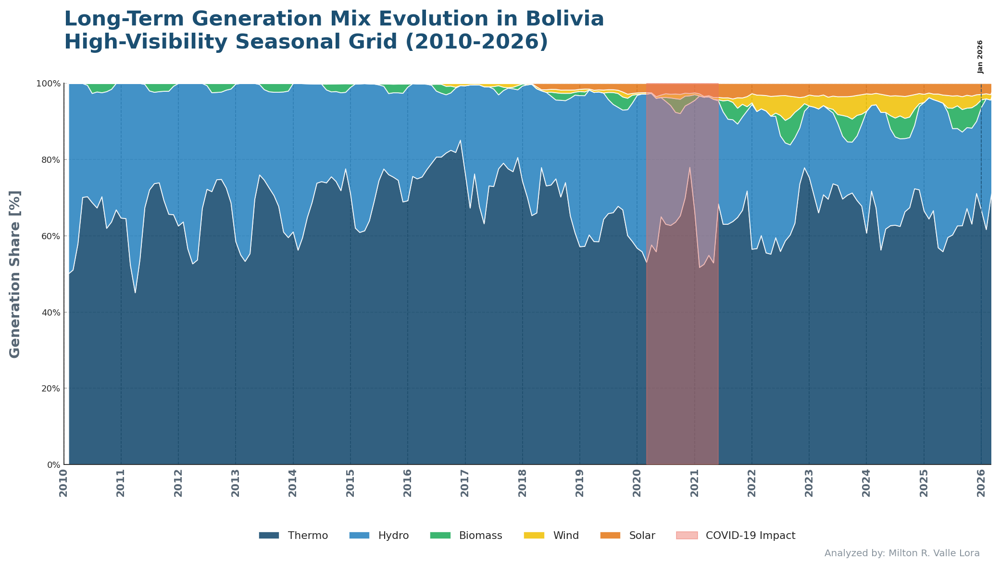

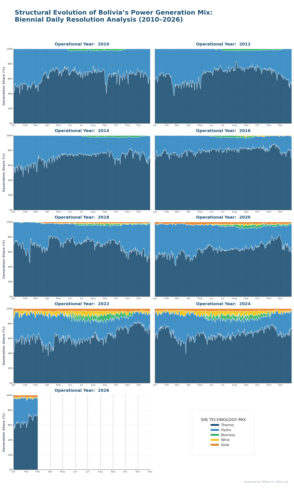

>- **The Dominance of Thermal Generation (Natural Gas)**: The analysis confirms that Bolivia's electricity matrix remains predominantly Thermoelectric. Based on daily dispatch data, Thermal generation consistently accounts for the bulk of the load, frequently reaching peaks of over 80% share.
>    - **The 2016 Drought Crisis**: A critical observation occurs in 2016, where Thermal generation sustained the system almost entirely. This year is identified as a significant "Dry Year" in Bolivia, where reduced hydrological inflow forced the system to rely on gas-fired units to ensure grid reliability, pushing thermal participation to its historical maximums.
>
>- **Hydrological Seasonality and Baseload**: Hydroelectric generation acts as the primary flexible resource, with a participation share oscillating between 15% and 40%.
>    - **The seasonality is clearly visible**: during the wet season (December–March), Hydro share expands, reducing the carbon intensity of the grid. Conversely, during the dry season (estiaje), its contribution shrinks, exposing the system’s vulnerability to climate variability.
>
>- **The Rise of Variable Renewable Energy (VRE)**: The "Decarbonization Signal" becomes evident in the latter half of the decade:
>    - **Wind Power**: Although initial pilots began around 2014, a structural shift is observed starting in late 2021, with the integration of large-scale wind farms in the Santa Cruz region, providing a new layer of non-conventional energy.
>    - **Solar Power**: Large-scale solar integration marks its definitive entry into the SIN in September 2018. This is visualized as a constant, thin orange band that has progressively thickened as new photovoltaic plants (e.g., Oruro, Uyuni) were commissioned.
>
>- **Biomass (The Agro-Industrial Seasonal Pulse)**: Biomass generation exhibits a unique Agro-Industrial seasonality tied to the sugarcane harvest (Zafra) in the northern and eastern regions.
>    - **Its contribution is concentrated between May and November**. During these months, biomass provides a stable and renewable baseload, often exceeding 3-5% of the total mix, before dropping to near-zero levels during the inter-harvest period.

 

### 9. Yearly Grid Stability and Rotational Dynamics

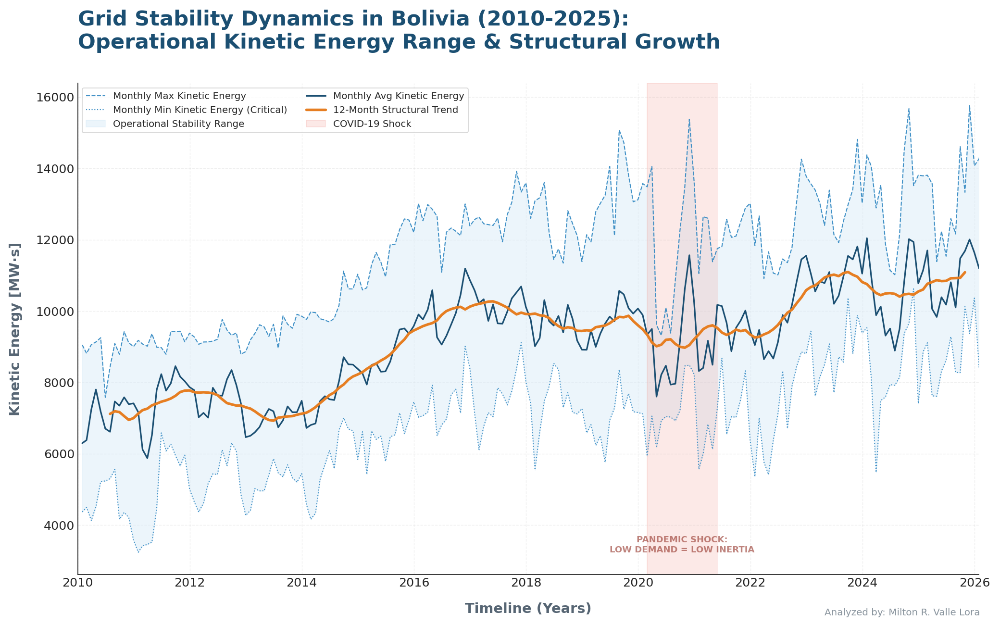

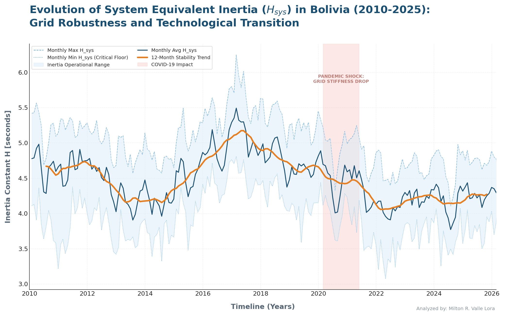

>- **Kinetic Energy ($E_k$) Analysis (System Growth and Volatility)**: The longitudinal trend of total Kinetic Energy ($MW \cdot s$) reflects the physical expansion of the Bolivian Interconnected System (SIN). From a power systems engineering perspective, we observe the following:
>
>    - **Structural Expansion**: The sustained upward slope of the 12-month trend confirms an aggressive commissioning of synchronous units (*Hydro and Thermal*) between 2010 and 2025. This "rotational reservoir" is the first line of defense against frequency contingencies.
>
>    - **Operational Envelope Expansion**: Note that the "gap" between the Monthly Max and Min has widened over time. This indicates that **the system’s stability is becoming increasingly dependent on the daily dispatch schedule**. During peak hours, the grid is robust, but during low-demand periods, the $E_k$ drops significantly, creating windows of vulnerability.
>
>    - **The 2020 Pandemic Anomaly**: The "Operational Shock" highlighted in the chart shows a contraction in $E_k$. This was not due to a loss of assets, but a reduction in online synchronous capacity. With lower industrial demand, large thermal units were de-committed, reducing the total available "rotating mass" and proving that $E_k$ is a dynamic operational variable, not a static one.

>- **System Equivalent Inertia ($H_{sys}$) Analysis (The Decarbonization Paradox)**: This is the most sensitive metric for grid stability. While $E_k$ is increasing, the System Inertia ($H_{sys}$) has been on a clear downward trajectory since mid-2017, accelerating in 2018.
>
>    - **The 2018 Inflection Point**: As identified in our "Generation Mix" analysis, 2018 marked the large-scale integration of Solar Photovoltaic plants. Unlike synchronous machines, Solar PV is an Inverter-Based Resource (IBR). Every MW of solar power that displaces a thermal unit effectively removes the $H$ constant of that unit from the system denominator, thus lowering the $H_{sys}$ average.
>
>    - **Grid "Lightness" and RoCoF Risk**: The decline from average values of ~4.8s (2010) to levels closer to ~4.4s (2025) indicates that the Bolivian grid is becoming "electrically lighter." A lower $H_{sys}$ means that for the same loss of generation (N-1 contingency), the Rate of Change of Frequency (RoCoF) will be steeper, leaving less time for under-frequency load shedding (UFLS) schemes to act.
>
>    - **Seasonal Fragility**: The "Operational Range" (Steel Blue area) shows that in recent years, the Minimum $H_{sys}$ has reached critical floors. These valleys coincide with periods of high solar penetration during the day and low demand at night.
>
>    - **Correlation with Technology Shift**: By cross-referencing this with our "Daily Generation Mix" chart, we confirm that the years with the highest integration of Wind and Solar (2021-2025) show the most significant volatility in $H_{sys}$. This is a clear indicator that the SIN is transitioning into a Low-Inertia Grid, requiring future investments in "Synthetic Inertia" or Fast Frequency Response (FFR).

 

###10. Monthly Grid Stability and Rotational Dynamics

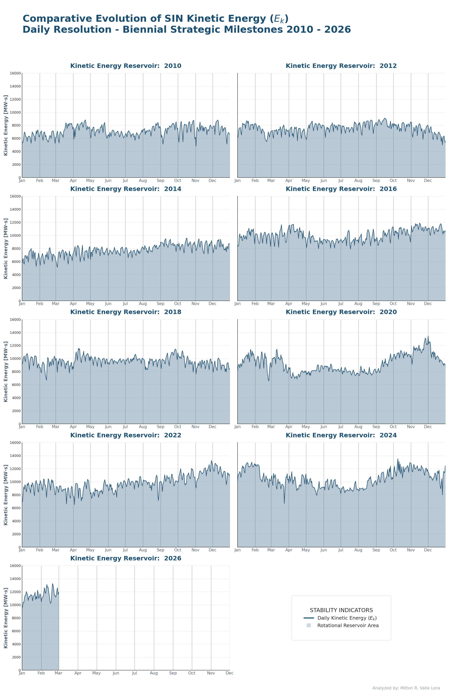

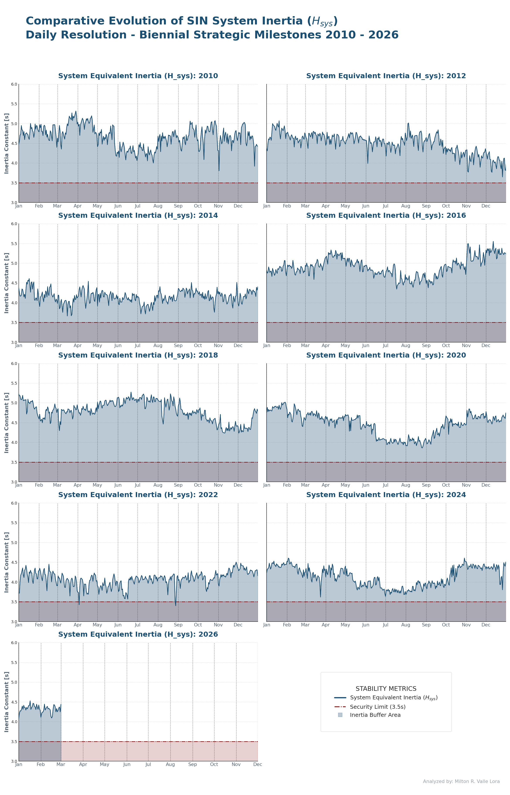

>1. **Kinetic Energy ($E_k$) Snapshot Analysis (Structural Scaling)**: The biennial breakdown of the rotational reservoir ($MW \cdot s$) provides a clear visualization of the "Massive Grid Expansion" over the last 16 years.
>
>    - **Volumetric Growth: From 2010 to 2026, the baseline of the $E_k$ reservoir has more than doubled. This is a direct consequence of the commissioning of large-scale synchronous projects (*such as Misicuni and major combined-cycle thermal plants*). The system is physically "heavier" now, which, under normal conditions, provides a larger buffer to absorb sudden power imbalances.
>
>    - **Intra-Year Volatility (Daily Resolution)**: The high-frequency oscillations visible in each panel represent the "Operational Pulse" of the grid. Sudden dips in $E_k$ (*especially visible in 2022 and 2024*) correlate with planned maintenance of high-inertia units. A Senior Operator must recognize these periods as "Low-Inertia Windows," where the N-1 contingency risk is significantly higher.
>  
>    - **The 2026 Operational Status**: As of early 2026, the $E_k$ remains at historical highs, confirming that the system has the physical capacity to support the current demand, provided that the synchronous units remain dispatched and synchronized.

>2. **System Equivalent Inertia ($H_{sys}$) Snapshot (The Stability Security Margin)**: While $E_k$ measures quantity, $H_{sys}$ measures the "Inertial Quality" of the grid. The inclusion of the Security Limit (3.5s) reveals a critical trend in the SIN's health.
>  
>    - **The Erosion of the Security Margin**: In the 2010–2014 period, the daily $H_{sys}$ operated comfortably between 4.5s and 5.5s, far above the security threshold. However, starting in 2018, coinciding with the massive integration of Inverter-Based Resources (IBR) like Solar and Wind, we observe a "Downward Compression" of the inertia constant.
>
>    - **Encroachment on the Critical Floor (3.5s)**: The most alarming observation is found in the 2022, 2024, and 2026 panels. The daily average has begun to "touch" and occasionally dip near the 3.5s Security Limit. This indicates that during specific hours (*high solar penetration or low demand*), the SIN operates as a "Weak Grid".
>  
>    - **RoCoF Vulnerability**: Operating near the 3.5s limit means that the Rate of Change of Frequency (RoCoF) during a trip of a major unit (e.g., a 100MW thermal block) could be violent enough to trigger Under-Frequency Load Shedding (UFLS) before the primary control can respond.
>  
>    - **Strategic Conclusion**: The "Decarbonization Paradox" is fully documented here: Bolivia is successfully integrating renewables, but at the cost of its natural inertial response. To maintain 2010-level stability in 2026, the system now requires advanced ancillary services, such as Synthetic Inertia or Grid-Forming Inverters.

> ---
>3. **Technical Justification for the 3.5s Inertia Security Threshold**: The selection of 3.5 seconds as the demarcation line between a "Robust System" and a "Vulnerable Low-Inertia System" is grounded in both classical power system stability theory and contemporary operational experiences from modern grids.
>
>    - **Theoretical Foundation (The Kundur Framework)**: According to Prabha Kundur in his seminal work "Power System Stability and Control", the inertia constant ($H$) directly dictates the Rate of Change of Frequency (RoCoF) immediately following a disturbance. In a system like the Bolivian SIN, as $H_{sys}$ falls below 3.5s, the RoCoF becomes significantly steeper. For a given power imbalance ($\Delta P$). As $H_{sys}$ decreases toward the 3.5s mark, the time available for the Primary Frequency Control (Governors) to arrest the frequency drop—before hitting the Frequency Nadir—is reduced to critical levels (often less than 2 seconds), the RoCoF is calculated as:
> $$\frac{df}{dt} = \frac{f_0 \cdot \Delta P}{2 \cdot H_{sys} \cdot S_{sys}}$$
>
>    - **International Benchmarks & Global Precedents**: Several international operators and regulatory bodies have identified similar thresholds to manage the transition to inverter-based resources (IBR):
>  
>        - `ENTSO-E (Europe)`: In studies regarding "Low Inertia Challenges," European TSOs have identified that systems operating with an equivalent inertia below 3.0s - 3.5s exhibit extreme sensitivity to N-1 contingencies, often requiring the implementation of Fast Frequency Response (FFR) or Synthetic Inertia.
>
>        - `EirGrid (Ireland)`: As a pioneer in high renewable penetration, EirGrid has historically monitored the "System Non-Synchronous Penetration" (SNSP). Their operational experience suggests that when the mix leads to an effective $H_{sys}$ near 3.5s, the risk of triggering Under-Frequency Load Shedding (UFLS) schemes increases exponentially due to the limited "braking" effect of the rotating masses.
>     
>        - `AEMO (Australia)`: In the South Australian grid (a system that, like Bolivia, has faced "islanded" conditions), operational constraints are often triggered when inertia levels approach these specific thresholds, leading to the mandatory commitment of synchronous condensers to keep the system above the fragility zone.

>4. **Bibliographic References and Global Technical Standards**
>
>    - **Fundamental Power Systems Theory**:
>
>        - **Kundur, P. (1994)**. Power System Stability and Control. McGraw-Hill Education.
>            - Note: Specifically Chapter 11, which defines the relationship between the inertia constant ($H$) and the frequency response of interconnected systems.
>
>        - **Anderson, P. M., & Fouad, A. A. (2003)**. Power System Control and Stability. IEEE Press.
>
>    - **International Grid Codes and Reports**
>  
>        - **ENTSO-E (European Network of Transmission System Operators for Electricity)**:
>            - Inertia and Rate of Change of Frequency (RoCoF). [Technical Report on Frequency Stability](https://eepublicdownloads.entsoe.eu/clean-documents/SOC%20documents/RGCE_SPD_frequency_stability_criteria_v10.pdf).
>
>            - ENTSO-E highlights that for smaller synchronous areas, values below 3.0s-3.5s require "Alternative Frequency Control" methods.
>
>        - **AEMO (Australian Energy Market Operator)**:
>     
>            - Inertia Requirements Methodology. [AEMO Inertia Service Provider Reports](https://www.aemo.com.au/-/media/files/electricity/nem/security_and_reliability/system-security-market-frameworks-review/2018/inertia_requirements_methodology_published.pdf?rev=975e0504a2ae48318e22e2df40e6ecd1&sc_lang=en&hash=2CE008E92BF2D043E623719E5689642D).
>
>            - Australia is a global benchmark for "Weak Grids" and has pioneered the definition of minimum inertia sub-limits for regional stability.
>
>    - **EirGrid & SONI (Ireland/Northern Ireland)**:
>  
>        - **DS3 Programme: Delivering a Secure Sustainable Power System. [Operational Constraints Update](https://cms.soni.ltd.uk/sites/default/files/publications/DASSA%20VFM%20Recommendations%20Paper%20vFinal%20SONI.pdf).
>
>        - EirGrid provides clear metrics on how low-inertia scenarios directly impact the "Frequency Nadir" during N-1 events.
>
>    - **Regional and Academic Research**
>  
>        - **NREL (National Renewable Energy Laboratory)**: Inertia and the Electric Grid: A Guide to the 21st Century. [NREL Technical Paper](https://docs.nlr.gov/docs/fy20osti/73856.pdf).
>
>            - An excellent resource for understanding how Inverter-Based Resources (IBR) like Solar/Wind physically displace traditional inertia.
> ---

 

## 🏗️ High-Performance Computing (HPC) Stack
To handle over **140,000 hourly records** and train deep architectures, I utilized a high-end workstation:
* **CPU:** AMD Ryzen 7 9800X3D (8C/16T).
* **RAM:** 96GB DDR5.
* **GPU:** **NVIDIA GeForce RTX 5070 Ti (16GB)**.
* **MLOps:** PyTorch Nightly with **SM_120 (Blackwell)** architecture support.

 

## 🤝 Professional Contact
Specialized in **Data Science & Machine Learning** for critical infrastructure and power systems.

**LinkedIn:** [Milton Rodolfo Valle Lora](https://www.linkedin.com/in/miltonvallelora/)  
**YouTube:** [DataScienceByDoing](https://www.youtube.com/@DataScienceByDoing)

---
**Analyzed by: Milton R. Valle Lora** *March 2026*

---
